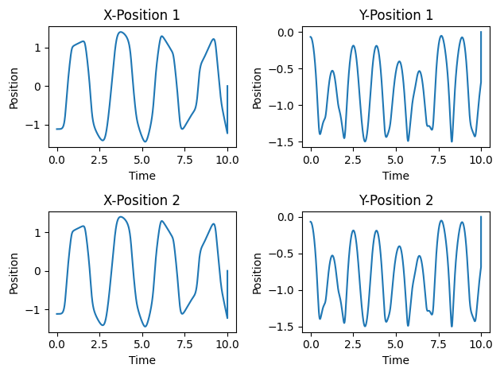

# Double Pendulum Art 🎨

An interactive double pendulum simulation that creates beautiful art through chaotic motion. Watch as the mathematically chaotic behavior of a double pendulum creates stunning, unique patterns that you can paint in real-time.



## ✨ Features

- **Interactive Art Creation**: Hold spacebar to paint with the pendulum's tip as it moves
- **Real-time Physics**: Accurate double pendulum simulation using 4th-order Runge-Kutta integration
- **Color Palette System**: 9 beautiful colors to choose from (keys 1-9)
- **Customizable Brush**: Adjustable brush size with +/- keys
- **Preset System**: Save and load different pendulum configurations
- **Art Export**: Save your creations as PNG images
- **Multiple Simulation Modes**: Pause, reset, and toggle pendulum visibility
- **Batch Generation**: Programmatically generate artwork collections

## 🚀 Quick Start

### Installation

#### Option 1: Install from PyPI (when published)
```bash
pip install double-pendulum-art
pendulum-art
```

#### Option 2: Install from Source
```bash
git clone https://github.com/mohidkhan/double-pendulum-art.git
cd double-pendulum-art
pip install -e .
python -m pendulum_art.game
```

#### Option 3: Run Directly
```bash
git clone https://github.com/mohidkhan/double-pendulum-art.git
cd double-pendulum-art
pip install numpy pygame matplotlib
python pendulum_art/game.py
```

### System Requirements

- Python 3.8+
- numpy >= 1.20.0
- pygame >= 2.0.0
- matplotlib >= 3.5.0

## 🎮 Controls

| Key | Action |
|-----|--------|
| `SPACE` | Hold to paint with pendulum tip |
| `1-9` | Select color from palette |
| `+/-` | Increase/decrease brush size |
| `P` | Pause/unpause simulation |
| `R` | Reset pendulum to initial position |
| `C` | Clear canvas (artwork) |
| `V` | Toggle pendulum visibility |
| `S` | Save current artwork as PNG |
| `L` | Load preset (if available) |
| `H` | Toggle help overlay |
| `ESC/Q` | Quit application |

## 📚 Usage Examples

### Interactive Mode
```python
from pendulum_art.game import PendulumArtGame

# Launch the interactive application
game = PendulumArtGame(width=1000, height=800)
game.run()
```

### Programmatic Art Generation
```python
import numpy as np
from pendulum_art.physics import DoublePendulum
from pendulum_art.utils import create_preset_pack

# Create a pendulum
pendulum = DoublePendulum(l1=1.0, l2=0.5)

# Set initial conditions
state = np.array([np.pi/4, np.pi/2, 0.0, 0.0])

# Simulate and generate art programmatically
# (see examples/basic_usage.py for complete example)
```

### Creating Custom Presets
```python
from pendulum_art.utils import save_preset, generate_rainbow_palette

# Create a custom initial state
custom_state = np.array([np.pi/3, -np.pi/4, 0.1, -0.05])

# Create a custom color palette
custom_palette = generate_rainbow_palette(num_colors=9)

# Save as preset
save_preset(custom_state, custom_palette, "my_custom_preset.json")
```

## 🔬 Physics Background

The double pendulum is a classic example of a chaotic dynamical system. Despite being governed by deterministic equations, tiny changes in initial conditions lead to dramatically different outcomes - the "butterfly effect."

### Equations of Motion

The system is governed by coupled nonlinear differential equations:

```
θ₁'' = [complex expression involving θ₁, θ₂, θ₁', θ₂']
θ₂'' = [complex expression involving θ₁, θ₂, θ₁', θ₂']
```

Where:
- `θ₁, θ₂` are the angles of the first and second pendulum
- `l₁, l₂` are the lengths of the rods
- `m₁, m₂` are the masses of the bobs
- `g` is gravitational acceleration

The simulation uses the 4th-order Runge-Kutta method for numerical integration, providing excellent accuracy and stability.

## 🎨 Art Gallery

The chaotic motion creates various artistic patterns:

- **Spirals**: Occur with certain initial angular velocities
- **Rosettes**: Beautiful flower-like patterns from specific configurations
- **Chaotic Scribbles**: Complex, seemingly random but deterministic paths
- **Figure-8s**: Periodic or quasi-periodic motions
- **Explosions**: Radial patterns from high-energy initial conditions

## 📦 Project Structure

```
double-pendulum-art/
├── pendulum_art/           # Main package
│   ├── __init__.py
│   ├── game.py            # Interactive game engine
│   ├── physics.py         # Double pendulum physics
│   ├── renderer.py        # Visualization components
│   └── utils.py           # Utilities and presets
├── examples/              # Usage examples
│   └── basic_usage.py
├── tests/                 # Unit tests
│   └── test_physics.py
├── docs/                  # Documentation
├── presets/              # Predefined configurations
├── pyproject.toml        # Project configuration
└── README.md
```

## 🧪 Running Tests

```bash
# Run physics tests
python tests/test_physics.py

# Run all tests with pytest (if installed)
pytest tests/
```

## 🤝 Contributing

Contributions are welcome! This project is open source and follows standard GitHub workflow:

1. Fork the repository
2. Create a feature branch (`git checkout -b feature/amazing-feature`)
3. Commit your changes (`git commit -m 'Add amazing feature'`)
4. Push to the branch (`git push origin feature/amazing-feature`)
5. Open a Pull Request

### Development Setup

```bash
git clone https://github.com/mohidkhan/double-pendulum-art.git
cd double-pendulum-art
pip install -e ".[dev]"
```

### Code Style

This project uses:
- `black` for code formatting
- `flake8` for linting
- `mypy` for type checking

Run formatting and checks:
```bash
black .
flake8 .
mypy pendulum_art/
```

## 📄 License

This project is licensed under the MIT License - see the [LICENSE](LICENSE) file for details.

## 🙏 Acknowledgments

- Inspired by the mathematical beauty of chaotic systems
- Built with Python's excellent scientific computing ecosystem
- Physics equations derived from classical mechanics textbooks
- Thanks to the open source community for the underlying libraries

## 📚 Educational Use

This project is perfect for:
- **Physics Education**: Demonstrating chaos theory and nonlinear dynamics
- **Programming Education**: Example of good Python project structure
- **Art and Science**: Showing the intersection of mathematics and creativity
- **Interactive Learning**: Hands-on exploration of complex systems

## 🔗 Related Resources

- [Chaos Theory](https://en.wikipedia.org/wiki/Chaos_theory)
- [Double Pendulum](https://en.wikipedia.org/wiki/Double_pendulum)
- [Runge-Kutta Method](https://en.wikipedia.org/wiki/Runge%E2%80%93Kutta_methods)
- [Equations of Motion PDF](Equations%20of%20Motion%20Derivation.pdf) (included in repository)

---

**Made with ❤️ and ⚡ chaos theory**

*"The butterfly effect: a small change in one state of a deterministic nonlinear system can result in large differences in a later state." - Edward Lorenz*

